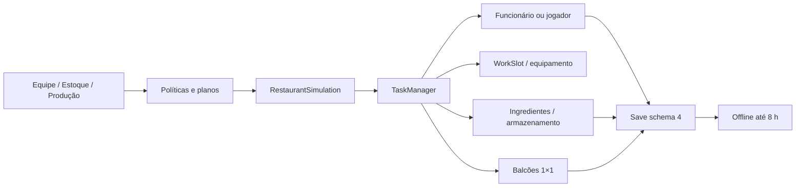

# Arquitetura

## Fluxo principal

`main.ts` carrega e migra o save, aplica progresso offline e inicia `RestaurantSimulation`, `RestaurantScene` e `GameUI`. A simulação não depende de Phaser nem do DOM. A cena apenas traduz estado lógico em sprites e profundidade isométrica.

## Módulos

- `src/content/`: ingredientes, receitas, estações, personagens e definições data-driven dos equipamentos por família/nível.
- `src/config/balance.ts`: economia, tempos, velocidades, recuperação, progressão e limite offline.
- `src/assets/pixel/`: atlas procedural de fallback e manifest TypeScript gerado dos renders Blender.
- `src/game/grid`, `navigation`, `map`: grade, ocupação indexada, A*, footprints, zonas de entrada/saída e mapa validado.
- `src/game/simulation/`: ciclo de clientes e grupos, assentos, pedidos, sincronização da equipe, escalonamento de reposição/produção e reconciliação operacional.
- `src/game/tasks/`: coordenador central com prioridade, responsável e reservas; pedidos urgentes preemptam trabalho preventivo sem duplicar recursos.
- `src/game/staff/`: contratação, agenda, estado operacional, folha, experiência, treinamento, pausa e demissão.
- `src/game/inventory/StorageService.ts`: capacidade física, compatibilidade por tipo, reservas de espaço e preservação de conteúdo por ID estável do móvel.
- `src/game/inventory/ProcurementService.ts`: solicitações manuais/automáticas, limites financeiros, deduplicação, transação e histórico.
- `src/game/cooking/ProductionPlanningService.ts`: planos até 999, lotes, estoque-alvo, reservas e distribuição entre módulos de balcão.
- `src/game/offline/`: cálculo determinístico por eventos, limitado a oito horas, incluindo equipe, salários, compras e produção.
- `src/game/save/`: IndexedDB, fallback local, schema 5, backup pré-correção espacial, migração idempotente e saneamento de reservas/layout.
- `src/scenes/`: carregamento de sprite sheets Blender, fallback raster, depth pela base/pés e visualização técnica local.
- `src/ui/`: criação do perfil, HUD operacional, estoque, tarefas, relatórios e ferramentas apenas em desenvolvimento.
- `tools/blender/`: fonte automatizada dos modelos, rig, animações, materiais, câmera, luz, render, manifest e validação.

## Persistência operacional

O save separa estado econômico do estado da operação. `operation` guarda atores, clientes, pedidos, assentos, estações, slots do balcão e tarefas. Ao carregar, posições fixas do mapa prevalecem, reservas são revalidadas, tarefas interrompidas voltam à fila e estados de transporte/preparo são reconciliados sem duplicar prato ou pagamento.

O schema 5 mantém os sistemas do schema 4 e acrescenta a normalização espacial. O repositório mantém `backup-before-spatial-schema-5`; a migração arredonda posições, hidrata footprint/âncora/escala/slots, limita mesas a duas cadeiras opostas e guarda excedentes sem apagar compras. Uma segunda migração é um no-op.

## Contrato espacial

`src/game/grid/SpatialLayoutService.ts` centraliza grade 64×32, rotação, footprint, contato inferior, escala, bounds, profundidade e slots. `CharacterFacing.ts` deriva facing a partir do vetor visual isométrico. A cena e o editor consomem esse contrato; não mantêm offsets locais por móvel.

IDs de conteúdo e de assets são estáveis. `visualLevel` e `gameplayLevel` são independentes; trocar `renderedAssetId` não altera posição, orientação, fila ou pedido da estação.

## Coordenação operacional 0.0.6

`RestaurantSimulation` é o único ponto que transforma políticas em tarefas físicas. Compras aprovadas viram `restock_purchase`; planos liberados viram `production_batch`. Ambos passam pelo mesmo `TaskManager` usado por pedidos, limpeza e pelo proprietário. A conclusão é transacional: estoque ou balcão só mudam depois que o ator alcança o WorkSlot e termina a animação.

As reservas são independentes e rastreáveis: ingrediente, equipamento, WorkSlot, espaço de armazenamento, quantidade futura no balcão e funcionário. Se não houver progresso, o coordenador libera apenas reservas comprovadamente antigas, recalcula a rota, tenta outro slot e retorna o agente a `idle` quando a tarefa não pode continuar.

## Dependências entre os novos sistemas

## Contrato visual 0.0.3

O manifest `reference-scene-v5` é a fonte de escala do runtime. Personagens usam anchors em pixels; mundo usa anchor normalizado na linha comum de piso 178/192. `nativeScale` permanece 1, o filtro é nearest e `isoDepth` recebe a célula frontal do footprint. Assim, tamanho visual, camada, colisão e alcance de interação permanecem independentes.
